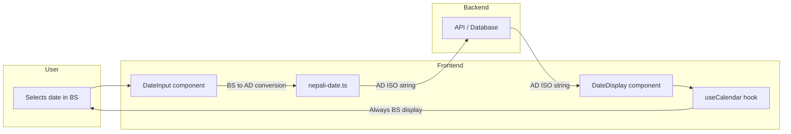

# Date Handling in Poultry360

This document describes how dates are converted, displayed, and received from users across the application. Use it as context when making changes to date-related features.

## Overview

- **User-facing**: The app uses **Nepali (BS)** calendar for all date display and input. The AD/BS toggle is hidden in UI but the switching logic remains for future re-enablement (see `common/config/calendar.ts`: `EFFECTIVE_CALENDAR_TYPE`, `CALENDAR_TOGGLE_VISIBLE`).
- **Storage & API**: All dates are stored and transmitted as **AD (Gregorian)** in ISO format.
- **Layer**: This is a **presentation-layer only** feature. No backend or schema changes.

---

## Calendar Systems

| System | Name | Format Example |
|--------|------|----------------|
| **AD** | Gregorian (Anno Domini) | `2025-02-05` |
| **BS** | Bikram Sambat (Nepali) | `2081-10-22` |

---

## Data Flow



---

## User Preference

- **Effective default**: Nepali (BS) for all users. The effective calendar is forced at runtime via `common/config/calendar.ts` (`EFFECTIVE_CALENDAR_TYPE = "BS"`); any stored preference is overridden for display/input.
- **Storage**: `user.calendarType` is still stored in auth store and persisted via `PATCH /users/preferences` when the calendar toggle is re-enabled.
- **Toggle visibility**: The Settings (and signup) calendar selector is hidden when `CALENDAR_TOGGLE_VISIBLE` is false. When re-enabled, the existing preference and API contract remain.

---

## Key Components & Modules

| Module | Role |
|--------|------|
| [`common/config/calendar.ts`](../src/common/config/calendar.ts) | `EFFECTIVE_CALENDAR_TYPE` (default BS), `CALENDAR_TOGGLE_VISIBLE` (hide AD/BS toggle). |
| [`common/lib/nepali-date.ts`](../src/common/lib/nepali-date.ts) | Pure conversion utilities. Single source of truth. |
| [`common/hooks/useCalendar.ts`](../src/common/hooks/useCalendar.ts) | React hook that uses effective calendar (BS) for display/input; conversion and AD support remain for re-enablement. |
| [`common/components/ui/date-input.tsx`](../src/common/components/ui/date-input.tsx) | Date input. BS mode: popover with Nepali calendar picker; AD mode: HTML5 date picker. Always emits AD ISO. |
| [`common/components/ui/date-display.tsx`](../src/common/components/ui/date-display.tsx) | Renders dates in user's preferred format (BS or AD). |

---

## Conversion Functions

All conversion logic lives in `common/lib/nepali-date.ts`:

| Function | Input | Output | Use case |
|----------|-------|--------|----------|
| `convertADtoBS(adDate)` | `Date` or `string` (AD) | `string` (YYYY-MM-DD BS) | Display AD dates in BS format |
| `convertBSToAD(bsDateString)` | `string` (YYYY-MM-DD BS) | `Date` | Convert user-selected BS date before sending to API |
| `parseDateStringLocal(dateStr)` | `string` (YYYY-MM-DD) | `Date` | Parse date strings without UTC-midnight edge cases |
| `formatADShort(date)` | `Date` or `string` | `string` (YYYY-MM-DD AD) | Format AD dates for display (avoids `toISOString` UTC issues) |
| `formatBSLong(date)` | `Date` or `string` | `string` (e.g. "Baisakh 1, 2081") | Long-form BS display |

---

## Format Expectations

### From user → frontend → API

| Layer | Format | Example |
|-------|--------|---------|
| User selects date | BS or AD (based on preference) | User picks in BS calendar |
| DateInput `onChange` | AD ISO string | `"2025-02-05T12:00:00.000Z"` or `"2025-02-05"` |
| Form state / filters | Typically `YYYY-MM-DD` | `"2025-02-05"` |
| API request body | AD, ISO or YYYY-MM-DD | Backend accepts both |

### From API → frontend → user

| Layer | Format | Example |
|-------|--------|---------|
| API response | AD ISO string | `"2025-02-05T00:00:00.000Z"` |
| DateDisplay | BS or AD (based on preference) | `"2081-10-22"` or `"Feb 5, 2025"` |

---

## Timezone Handling

- **NEPAL_OFFSET**: Nepal is UTC+5:45. The conversion logic uses `NEPAL_OFFSET` (5.75 hours) to align with Nepal-local semantics.
- **Parsing**: `parseDateStringLocal` parses `YYYY-MM-DD` as local date (noon) to avoid UTC-midnight edge cases.
- **Display**: AD dates are formatted using local formatting, not `toISOString()`, to prevent off-by-one errors.

---

## Using Dates in New Code

### Displaying a date
```tsx
import { DateDisplay } from "@/common/components/ui/date-display";

<DateDisplay date={sale.date} format="short" />   {/* YYYY-MM-DD */}
<DateDisplay date={sale.date} format="long" />    {/* Month Day, Year */}
<DateDisplay date={sale.date} format="relative" /> {/* Today, Yesterday, etc. */}
```

### Collecting a date from user
```tsx
import { DateInput } from "@/common/components/ui/date-input";

<DateInput
  label="Date"
  value={form.date}
  onChange={(v) => setForm((p) => ({ ...p, date: v.includes("T") ? v.split("T")[0] : v }))}
/>
```

### In non-React code (utils, fetchers)
Use `common/lib/nepali-date.ts` directly. Pass `calendarType` if needed for display logic.

---

## preferNativeInput

`DateInput` has a `preferNativeInput` prop. When `true`, it always shows the native HTML date picker (AD) instead of the BS text input.

---

## Common Gotchas

1. **Don't use raw `Input type="date"`** – It bypasses the user's calendar preference. Use `DateInput` instead.
2. **Don't use `toLocaleDateString` or custom formatDate** – Use `DateDisplay` or `useCalendar().toDisplayDate()` so BS preference is respected.
3. **Avoid `new Date("YYYY-MM-DD")` alone** – It parses as UTC midnight. Use `parseDateStringLocal()` for date-only strings.
4. **Don't use `toISOString().split("T")[0]` for display** – It uses UTC and can shift the date. Use `formatADShort()` or `DateDisplay`.

---

## Dependencies

- `nepali-date-converter` – Core conversion library (used for all BS ↔ AD conversion)
- `@sbmdkl/nepali-datepicker-reactjs` – BS calendar picker (shown in a Popover for BS mode; portaled to avoid modal issues)
