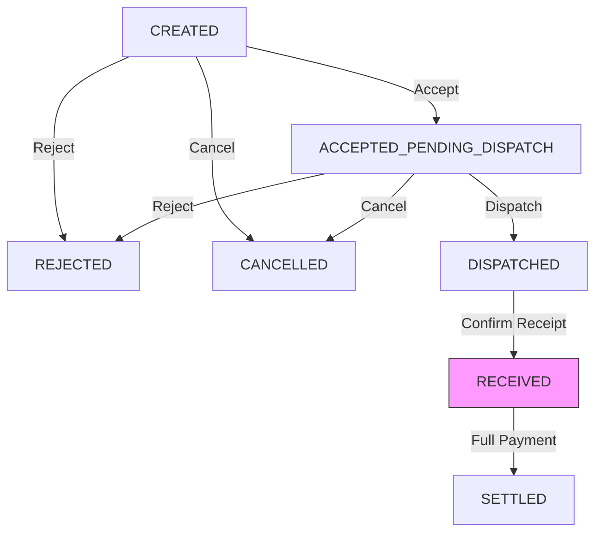
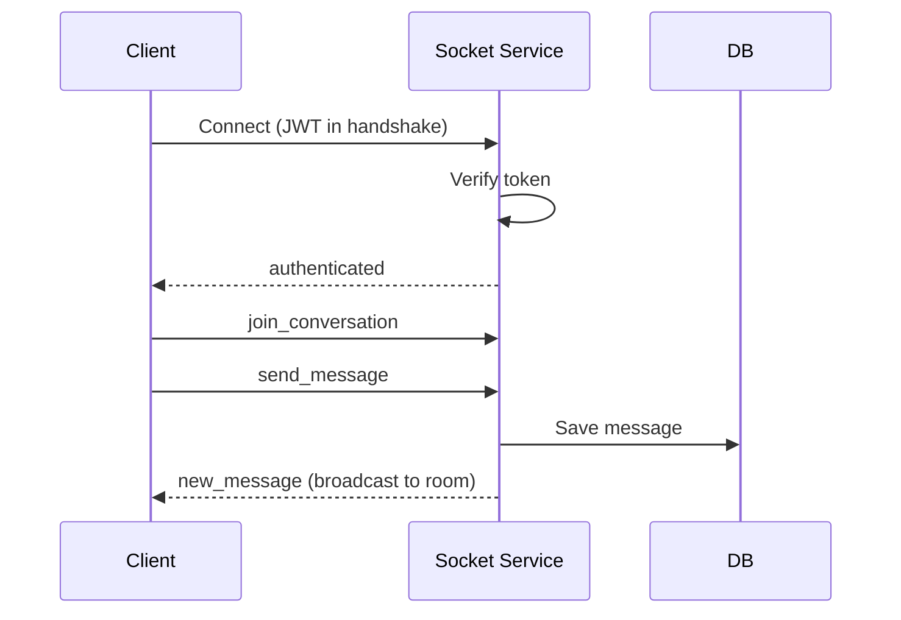
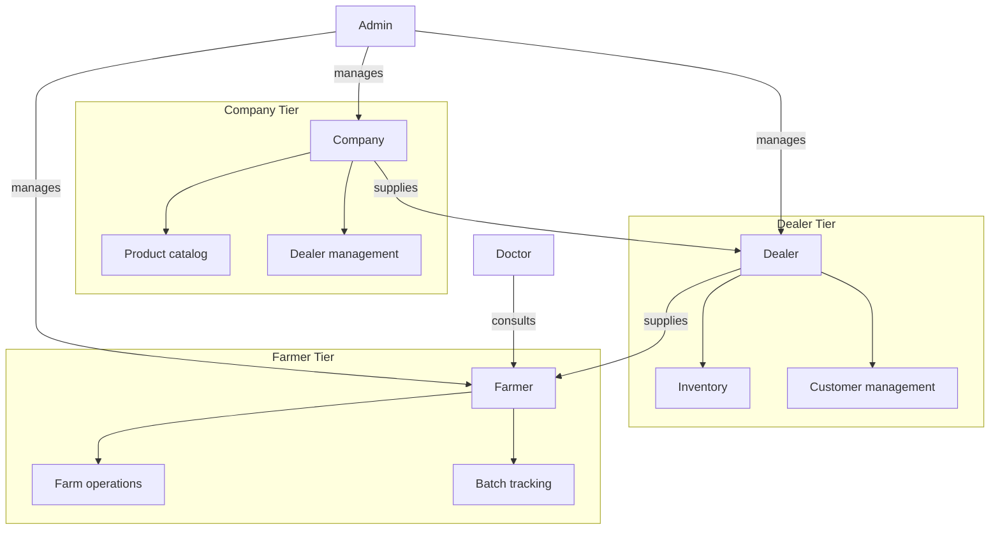
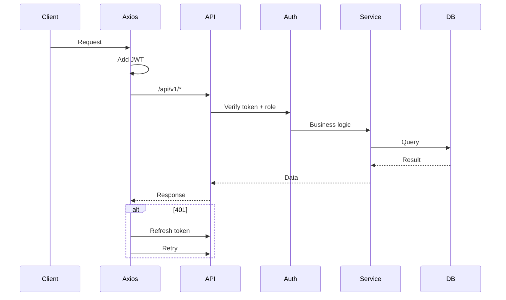
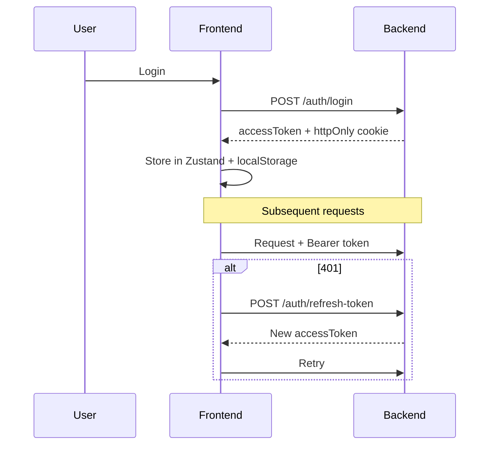

# Poultry360 — Project Context

## Overview

**Poultry360** is a three-tier management system for the poultry supply chain:

| Tier | Role | Key Features |
|------|------|--------------|
| **Company** | Top | Product catalog, dealer management, company sales & ledger |
| **Dealer** | Middle | Inventory, customer (farmer) management, consignments, payments |
| **Farmer** | Bottom | Farm operations, batch tracking, consignment requests |
| **Doctor** | Service | Consultations with farmers via real-time chat |
| **Admin** | System | Cross-tier management and reporting |

The system supports consignments, sales/payment requests, inventory, vaccinations, reminders, and real-time notifications.

---

## Project Structure

```
Poultry360/
├── apps/
│   ├── backend/          # Express 5 API, Prisma, Socket.IO
│   └── frontend/         # Next.js 15 App Router
├── pnpm-workspace.yaml   # pnpm workspaces config
└── package.json
```

> **Note:** The `/packages/` folder is deprecated and no longer used. Do not import from or modify it.

**Stack:** Next.js 15, React 19, TanStack Query, Zustand, Socket.IO, Express 5, Prisma, PostgreSQL, Tailwind CSS, Radix UI

**Run:** `pnpm install && pnpm dev` from repo root

---

## Key Documentation

| Document | Purpose |
|----------|---------|
| [DATABASE_ARCHITECTURE.md](./DATABASE_ARCHITECTURE.md) | Schema, entities, relationships, enums |
| [DEPLOYMENT.md](./DEPLOYMENT.md) | Subdomain config, env vars, build process |
| [UNIFIED_APP_REFACTOR_PLAN.md](./UNIFIED_APP_REFACTOR_PLAN.md) | Migration to unified frontend |
| `apps/frontend/src/app/ROUTE_STRUCTURE.md` | Route hierarchy |
| `apps/frontend/src/fetchers/README.md` | TanStack Query patterns |
| `apps/frontend/src/common/README.md` | Shared frontend code |

---

## Consignment Workflow (Critical)

Consignments are the core business workflow. The state machine is enforced in `ConsignmentService`.



**S3 (RECEIVED) is critical:** triggers inventory transfer, sale creation, ledger entries, and prepayment application. Changes to consignment workflow must preserve these side effects.

---

## Authentication & Authorization

### Flow

1. **Login** `POST /auth/login` → returns `accessToken` + sets `refreshToken` as httpOnly cookie
2. **Frontend** stores `accessToken` in Zustand (persisted to localStorage)
3. **Axios interceptor** adds `Authorization: Bearer <token>` to requests
4. **On 401:** interceptor calls `/auth/refresh-token` (uses httpOnly cookie), retries request
5. **On refresh failure:** clears auth, redirects to `/auth/login`

### Roles

| Role | Route Prefix | Default Dashboard |
|------|--------------|-------------------|
| `OWNER`, `MANAGER` | `/farmer/*` | `/farmer/dashboard/home` |
| `DEALER` | `/dealer/*` | `/dealer/dashboard/home` |
| `COMPANY` | `/company/*` | `/company/dashboard/home` |
| `DOCTOR` | `/doctor/*` | `/doctor/dashboard` |
| `SUPER_ADMIN` | `/admin/*` | `/admin/dashboard` |

Backend enforces roles via `authMiddleware(req, res, next, [allowedRoles])`. Frontend uses `AuthGuard` + `RoleBasedMiddleware` for route protection.

### Verification Flows

- **Dealer → Company:** Dealer requests link; company approves/denies (`/api/v1/verification/dealers`)
- **Farmer → Dealer:** Farmer requests link; dealer approves/denies (`/api/v1/verification/farmers`)

---

## Frontend Routing

### Subdomain Strategy

Production uses subdomain-based routing. Middleware (`apps/frontend/middleware.ts`) rewrites paths:

| Subdomain | Internal Path |
|-----------|---------------|
| `farmer.p360.com/dashboard` | `/farmer/dashboard` |
| `dealer.p360.com/dashboard` | `/dealer/dashboard` |
| `company.p360.com/dashboard` | `/company/dashboard` |
| `doctor.p360.com/dashboard` | `/doctor/dashboard` |
| `admin.p360.com/dashboard` | `/admin/dashboard` |

**Local dev:** Access routes directly at `localhost:3000/farmer/*`, etc.

### Layout Hierarchy

```
Root Layout (providers)
  └─ Role Layout (AuthGuard)
      └─ Dashboard Layout (Sidebar, Topbar, MobileBottomNav)
          └─ Page
```

### Provider Stack (order matters)

```
AuthProvider → QueryProvider → InventoryProvider → ChatProvider → ToastProvider → LoadingProvider → RoleBasedMiddleware → AuthGuard
```

---

## State Management

### TanStack Query (Server State)

All API data fetching uses TanStack Query via hooks in `apps/frontend/src/fetchers/`.

**Pattern per domain:**
```typescript
// Query keys (e.g., batchKeys)
export const batchKeys = {
  all: ['batches'] as const,
  lists: () => [...batchKeys.all, 'list'] as const,
  detail: (id: string) => [...batchKeys.all, 'detail', id] as const,
  farmBatches: (farmId: string) => [...batchKeys.all, 'farm', farmId] as const,
};

// Query hook
export const useGetBatch = (id: string) => useQuery({
  queryKey: batchKeys.detail(id),
  queryFn: () => axiosInstance.get(`/batches/${id}`).then(res => res.data),
});

// Mutation with cache invalidation
export const useCreateBatch = () => useMutation({
  mutationFn: (data) => axiosInstance.post('/batches', data),
  onSuccess: (_, variables) => {
    queryClient.invalidateQueries({ queryKey: batchKeys.lists() });
    queryClient.invalidateQueries({ queryKey: batchKeys.farmBatches(variables.farmId) });
  },
});
```

**Cache invalidation rules:**
- Create → invalidate lists + scoped lists (e.g., `farmBatches`)
- Update → invalidate detail + lists + related keys
- Delete → `removeQueries` for detail, `invalidateQueries` for lists

### Zustand (Auth State)

`apps/frontend/src/common/store/store.ts` holds `user`, `accessToken`, `isAuthenticated`. Persisted to localStorage.

### React Context

- **ChatContext:** Socket.IO state, messages, typing, presence
- **InventoryContext:** Local UI state for inventory views

---

## Backend Architecture

### API Structure

All routes prefixed with `/api/v1`. Organized by domain in `apps/backend/src/router/`.

| Category | Routes | Purpose |
|----------|--------|---------|
| Auth | `/auth` | Login, register, refresh, logout |
| Consignments | `/consignments` | Consignment workflow |
| Dealer | `/dealer/*` | Products, sales, cart, ledger |
| Company | `/company/*` | Products, sales, analytics |
| Farms/Batches | `/farms`, `/batches` | Farm and batch CRUD |
| Inventory | `/inventory` | Stock tracking |
| Communication | `/conversations`, `/messages` | Chat |
| Notifications | `/notifications`, `/reminder-notifications` | Push + reminders |

### Controller-Service Pattern

```
Request → authMiddleware → Controller (validate, extract userId/role) → Service (business logic) → Prisma → Response
```

Services handle transactions, state machines, and domain logic. Controllers handle HTTP concerns.

### Key Services

| Service | Purpose |
|---------|---------|
| `ConsignmentService` | State machine, inventory transfer, ledger entries |
| `CompanyDealerAccountService` | Company-dealer account-based ledger (see [Ledger Architecture](#ledger-system-architecture-critical)) |
| `DealerService` | Dealer operations, farmer/customer balance-based ledger |
| `SocketService` | JWT socket auth, room management, real-time events |
| `webpushService` | Web Push notifications |
| `ReminderCronService` | Cron job for vaccination/reminder notifications |

---

## Real-time (Socket.IO)

### Architecture



### Events

| Client → Server | Server → Client |
|-----------------|-----------------|
| `join_conversation`, `leave_conversation` | `joined_conversation`, `conversation_history` |
| `send_message` | `message_sent`, `new_message` |
| `typing_start`, `typing_stop` | `user_typing` |
| `mark_messages_read` | `messages_read` |

### Chat Features

- **Message types:** TEXT, IMAGE, VIDEO, AUDIO, PDF, DOC, BATCH_SHARE, FARM_SHARE
- **Voice messages:** AUDIO type with `durationMs`
- **Batch sharing:** BATCH_SHARE type with `batchShareId`
- **Presence:** `markUserOnline`/`markUserOffline` in roomService
- **Push notifications:** Sent to offline users via webpushService

---

## Environment Variables

```
PORT                 # Server port (default: 8081)
JWT_SECRET           # Access token secret
JWT_REFRESH_SECRET   # Refresh token secret
FRONTEND_URLS        # Comma-separated allowed origins
DATABASE_URL         # PostgreSQL connection string
VAPID_PUBLIC_KEY     # Web push public key
VAPID_PRIVATE_KEY    # Web push private key
NODE_ENV             # development/production/test
```

---

## Development Guidelines

### Adding Features

| Task | Location | Notes |
|------|----------|-------|
| New API route | `apps/backend/src/router/` | Create route file, add to `index.ts` |
| New controller | `apps/backend/src/controller/` | Extract userId from `req.userId`, validate with Zod |
| New service | `apps/backend/src/services/` | Business logic, transactions |
| Schema change | `apps/backend/prisma/schema.prisma` | Run `prisma migrate dev` |
| New query hook | `apps/frontend/src/fetchers/` | Follow `*Keys` + `useGet*`/`useCreate*` pattern |
| New page | `apps/frontend/src/app/[role]/dashboard/` | Use role layout, wrap with AuthGuard |

### Response Format

```typescript
// Success
{ success: true, data: any, message?: string }

// Error
{ message: string, error?: string }
```

### Common Patterns

1. **Consignment changes:** Follow state machine; ensure S3 side effects (inventory, ledger) are preserved
2. **New entity:** Add Prisma model → create service → create controller → create route → create frontend query hooks
3. **Role-specific feature:** Add route under role prefix, enforce role in authMiddleware, use role layout on frontend
4. **Real-time feature:** Add socket event handler in SocketService, emit from service layer, handle in ChatContext

---

## Visual Architecture

### System Overview



### API Request Flow



### Auth Flow



---

## Ledger System Architecture (Critical)

The system uses **two different ledger architectures** depending on the tier relationship. Do not mix these approaches.

### Company ↔ Dealer: Account-Based Ledger

Uses `CompanyDealerAccount` as a running account between each company-dealer pair.

```
CompanyDealerAccount (one per company-dealer pair)
├── balance         → Running balance (positive = dealer owes, negative = advance)
├── totalSales      → Cumulative sales amount
├── totalPayments   → Cumulative payments amount
└── CompanyDealerPayment[] → Individual payment records with balanceAfter snapshots
```

**Key characteristics:**
- Payments are **NOT tied to specific sales** — they reduce the account balance directly
- Sales increment account balance, payments decrement it
- Account is upserted atomically to prevent race conditions
- `CompanyDealerAccountService` handles all account operations

**Do NOT:**
- Try to allocate payments to specific company sales (bill-wise)
- Add `paidAmount`/`dueAmount` fields to `CompanySale` — use account balance only

### Dealer ↔ Farmer/Customer: Balance-Based Ledger

Uses a `balance` field on the `Customer` model (and aggregated `dueAmount` for farmers).

```
Customer
└── balance → Single field (positive = owes dealer, negative = advance/prepayment)

DealerSale
├── totalAmount
├── paidAmount
└── dueAmount   → Used for farmer balance calculation
```

**Key characteristics:**
- For **static customers**: `Customer.balance` is the source of truth
- For **farmers (User)**: balance is calculated by summing `DealerSale.dueAmount`
- Supports both general payments (account-based via balance field) and bill-wise payments
- `DealerService.addGeneralPayment()` updates `Customer.balance` directly using FIFO allocation
- `DealerService.addSalePayment()` updates specific sale's `paidAmount`/`dueAmount`

**Do NOT:**
- Create a separate `DealerCustomerAccount` model — use `Customer.balance` field
- Assume farmer ledger works the same as customer ledger (farmers use sale aggregation)

### Summary Table

| Relationship | Ledger Type | Balance Source | Payment Allocation |
|--------------|-------------|----------------|-------------------|
| Company → Dealer | Account-based | `CompanyDealerAccount.balance` | Account-level only |
| Dealer → Customer | Balance field | `Customer.balance` | FIFO to sales + balance field |
| Dealer → Farmer | Sale aggregation | Sum of `DealerSale.dueAmount` | Bill-wise to individual sales |

---

## Quick Reference

- **Run dev:** `pnpm dev` from repo root
- **Schema:** `apps/backend/prisma/schema.prisma`
- **Routes:** `apps/backend/src/router/index.ts`
- **Frontend queries:** `apps/frontend/src/fetchers/`
- **Auth store:** `apps/frontend/src/common/store/store.ts`
- **Socket service:** `apps/backend/src/services/socketService.ts`
- **Consignment service:** `apps/backend/src/services/consignmentService.ts`
