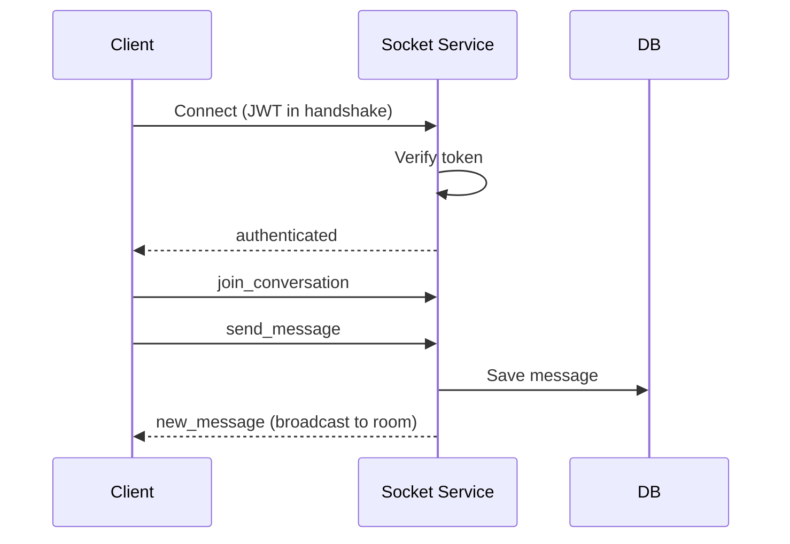
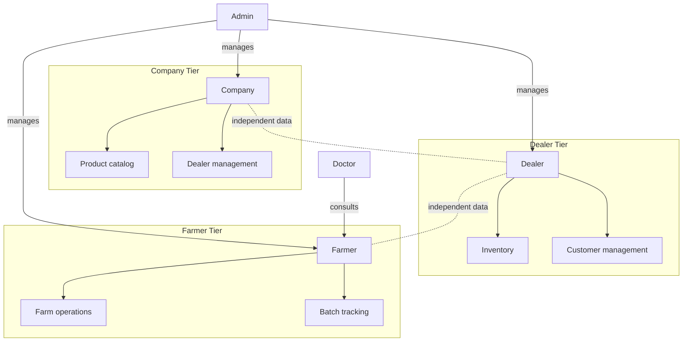
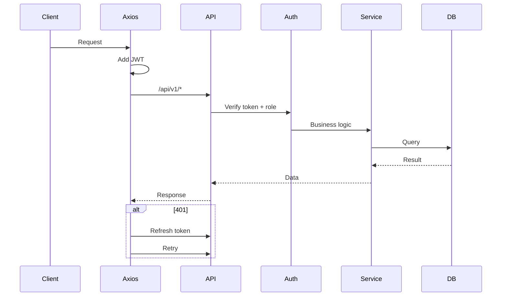
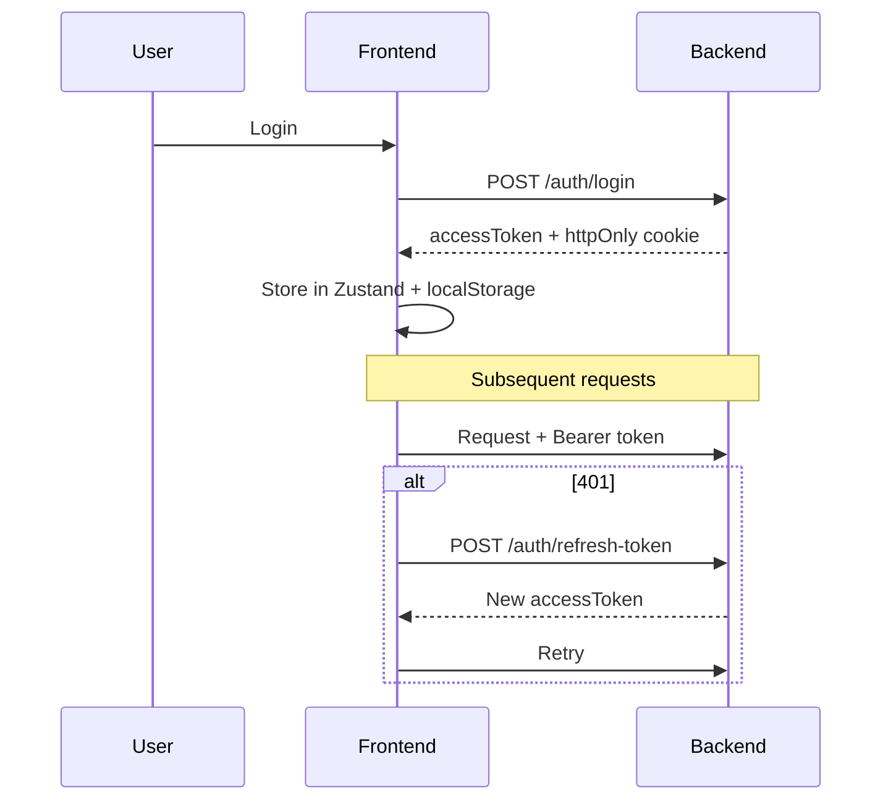

# Poultry360 — Project Context

## Overview

**Poultry360** is a three-tier management system for the poultry supply chain:

| Tier | Role | Key Features |
|------|------|--------------|
| **Company** | Independent business | Product catalog, company sales, supplier and dealer records |
| **Dealer** | Independent business | Inventory, manual customers and suppliers, product sales, Broiler settlement |
| **Farmer** | Independent business | Farm operations, batch tracking, sales and expenses |
| **Doctor** | Service | Consultations with farmers via real-time chat |
| **Admin** | System | Cross-tier management and reporting |

Each business account owns its own data. The system supports inventory, sales, payments,
vaccinations, reminders, staff access, and real-time notifications without automatic cross-account
sales, payment requests, or balance updates.

---

## Project Structure

```
Poultry360/
├── apps/
│   ├── backend/          # Express 5 API, Prisma, Socket.IO
│   └── frontend/         # Next.js 15 App Router
├── pnpm-workspace.yaml   # pnpm workspaces config
└── package.json
```

> **Note:** The `/packages/` folder is deprecated and no longer used. Do not import from or modify it.

**Stack:** Next.js 15, React 19, TanStack Query, Zustand, Socket.IO, Express 5, Prisma, PostgreSQL, Tailwind CSS, Radix UI

**Run:** `pnpm install && pnpm dev` from repo root

---

## Key Documentation

| Document | Purpose |
|----------|---------|
| [DATABASE_ARCHITECTURE.md](./DATABASE_ARCHITECTURE.md) | Schema, entities, relationships, enums |
| [DEPLOYMENT.md](./DEPLOYMENT.md) | Subdomain config, env vars, build process |
| [UNIFIED_APP_REFACTOR_PLAN.md](./UNIFIED_APP_REFACTOR_PLAN.md) | Migration to unified frontend |
| `apps/frontend/src/app/ROUTE_STRUCTURE.md` | Route hierarchy |
| `apps/frontend/src/fetchers/README.md` | TanStack Query patterns |
| `apps/frontend/src/common/README.md` | Shared frontend code |

---

## Independent Business Accounts (Critical)

The current product direction is independent accounts. A Company, Dealer, Farmer, Hatchery, or
other business account must not automatically create, update, or settle records in another
account.

- Sales, purchases, inventory, balances, and payments belong to the account that records them.
- Use manual customers and manual suppliers for Dealer operations.
- Do not add new connection requests, shared carts, consignment flows, payment-request flows, or
  cross-account balance synchronization.
- Older connection-related models, routes, and service code remain only for historical data and
  backwards compatibility. Do not extend them for new work.

---

## Authentication & Authorization

### Flow

1. **Login** `POST /auth/login` → returns `accessToken` + sets `refreshToken` as httpOnly cookie
2. **Frontend** stores `accessToken` in Zustand (persisted to localStorage)
3. **Axios interceptor** adds `Authorization: Bearer <token>` to requests
4. **On 401:** interceptor calls `/auth/refresh-token` (uses httpOnly cookie), retries request
5. **On refresh failure:** clears auth, redirects to `/auth/login`

### Roles

| Role | Route Prefix | Default Dashboard |
|------|--------------|-------------------|
| `OWNER`, `MANAGER` | `/farmer/*` | `/farmer/dashboard/home` |
| `DEALER` | `/dealer/*` | `/dealer/dashboard/home` |
| `COMPANY` | `/company/*` | `/company/dashboard/home` |
| `DOCTOR` | `/doctor/*` | `/doctor/dashboard` |
| `SUPER_ADMIN` | `/admin/*` | `/admin/dashboard` |

Backend enforces roles via `authMiddleware(req, res, next, [allowedRoles])`. Frontend uses `AuthGuard` + `RoleBasedMiddleware` for route protection.

### Account Relationships

Do not treat account relationships as a live workflow. New records are independent; any older
linked-account data must remain readable without causing new side effects in another account.

### Onboarding Approval

`User.status = ACTIVE` and onboarding approval are separate checks. A new account with a
`UserOnboardingPayment` record remains blocked while `lockedUntilApproved` is true and its state
is not `PAYMENT_APPROVED`. Super Admin must approve it from **Payment Approvals**; that approval
unlocks the account as well as setting the user status active. Demo and clean local seeds create
approved onboarding records so their accounts can log in immediately.

---

## Frontend Routing

### Subdomain Strategy

Production uses subdomain-based routing. Middleware (`apps/frontend/middleware.ts`) rewrites paths:

| Subdomain | Internal Path |
|-----------|---------------|
| `farmer.p360.com/dashboard` | `/farmer/dashboard` |
| `dealer.p360.com/dashboard` | `/dealer/dashboard` |
| `company.p360.com/dashboard` | `/company/dashboard` |
| `doctor.p360.com/dashboard` | `/doctor/dashboard` |
| `admin.p360.com/dashboard` | `/admin/dashboard` |

**Local dev:** Access routes directly at `localhost:3000/farmer/*`, etc.

### Layout Hierarchy

```
Root Layout (providers)
  └─ Role Layout (AuthGuard)
      └─ Dashboard Layout (Sidebar, Topbar, MobileBottomNav)
          └─ Page
```

### Provider Stack (order matters)

```
AuthProvider → QueryProvider → InventoryProvider → ChatProvider → ToastProvider → LoadingProvider → RoleBasedMiddleware → AuthGuard
```

---

## State Management

### TanStack Query (Server State)

All API data fetching uses TanStack Query via hooks in `apps/frontend/src/fetchers/`.

**Pattern per domain:**
```typescript
// Query keys (e.g., batchKeys)
export const batchKeys = {
  all: ['batches'] as const,
  lists: () => [...batchKeys.all, 'list'] as const,
  detail: (id: string) => [...batchKeys.all, 'detail', id] as const,
  farmBatches: (farmId: string) => [...batchKeys.all, 'farm', farmId] as const,
};

// Query hook
export const useGetBatch = (id: string) => useQuery({
  queryKey: batchKeys.detail(id),
  queryFn: () => axiosInstance.get(`/batches/${id}`).then(res => res.data),
});

// Mutation with cache invalidation
export const useCreateBatch = () => useMutation({
  mutationFn: (data) => axiosInstance.post('/batches', data),
  onSuccess: (_, variables) => {
    queryClient.invalidateQueries({ queryKey: batchKeys.lists() });
    queryClient.invalidateQueries({ queryKey: batchKeys.farmBatches(variables.farmId) });
  },
});
```

**Cache invalidation rules:**
- Create → invalidate lists + scoped lists (e.g., `farmBatches`)
- Update → invalidate detail + lists + related keys
- Delete → `removeQueries` for detail, `invalidateQueries` for lists

### Zustand (Auth State)

`apps/frontend/src/common/store/store.ts` holds `user`, `accessToken`, `isAuthenticated`. Persisted to localStorage.

### React Context

- **ChatContext:** Socket.IO state, messages, typing, presence
- **InventoryContext:** Local UI state for inventory views

---

## Backend Architecture

### API Structure

All routes prefixed with `/api/v1`. Organized by domain in `apps/backend/src/router/`.

| Category | Routes | Purpose |
|----------|--------|---------|
| Auth | `/auth` | Login, register, refresh, logout |
| Dealer | `/dealer/*` | Products, sales, cart, ledger |
| Company | `/company/*` | Products, sales, analytics |
| Farms/Batches | `/farms`, `/batches` | Farm and batch CRUD |
| Inventory | `/inventory` | Stock tracking |
| Communication | `/conversations`, `/messages` | Chat |
| Notifications | `/notifications`, `/reminder-notifications` | Push + reminders |

### Controller-Service Pattern

```
Request → authMiddleware → Controller (validate, extract userId/role) → Service (business logic) → Prisma → Response
```

Services handle transactions, state machines, and domain logic. Controllers handle HTTP concerns.

### Key Services

| Service | Purpose |
|---------|---------|
| `CompanyDealerAccountService` | Legacy linked-account support; do not use for new independent workflows |
| `DealerService` | Dealer operations, farmer/customer balance-based ledger |
| `SocketService` | JWT socket auth, room management, real-time events |
| `webpushService` | Web Push notifications |
| `ReminderCronService` | Cron job for vaccination/reminder notifications |

---

## Real-time (Socket.IO)

### Architecture


```mermaid
sequenceDiagram
    participant Client
    participant Socket as Socket Service
    participant DB

    Client->>Socket: Connect (JWT in handshake)
    Socket->>Socket: Verify token
    Socket-->>Client: authenticated
    Client->>Socket: join_conversation
    Client->>Socket: send_message
    Socket->>DB: Save message
    Socket-->>Client: new_message (broadcast to room)
```

### Events

| Client → Server | Server → Client |
|-----------------|-----------------|
| `join_conversation`, `leave_conversation` | `joined_conversation`, `conversation_history` |
| `send_message` | `message_sent`, `new_message` |
| `typing_start`, `typing_stop` | `user_typing` |
| `mark_messages_read` | `messages_read` |

### Chat Features

- **Message types:** TEXT, IMAGE, VIDEO, AUDIO, PDF, DOC, BATCH_SHARE, FARM_SHARE
- **Voice messages:** AUDIO type with `durationMs`
- **Batch sharing:** BATCH_SHARE type with `batchShareId`
- **Presence:** `markUserOnline`/`markUserOffline` in roomService
- **Push notifications:** Sent to offline users via webpushService

---

## Environment Variables

```
PORT                 # Server port (default: 8081)
JWT_SECRET           # Access token secret
JWT_REFRESH_SECRET   # Refresh token secret
FRONTEND_URLS        # Comma-separated allowed origins
DATABASE_URL         # PostgreSQL connection string
VAPID_PUBLIC_KEY     # Web push public key
VAPID_PRIVATE_KEY    # Web push private key
NODE_ENV             # development/production/test
```

---

## Development Guidelines

### Adding Features

| Task | Location | Notes |
|------|----------|-------|
| New API route | `apps/backend/src/router/` | Create route file, add to `index.ts` |
| New controller | `apps/backend/src/controller/` | Extract userId from `req.userId`, validate with Zod |
| New service | `apps/backend/src/services/` | Business logic, transactions |
| Schema change | `apps/backend/prisma/schema.prisma` | Run `prisma migrate dev` |
| New query hook | `apps/frontend/src/fetchers/` | Follow `*Keys` + `useGet*`/`useCreate*` pattern |
| New page | `apps/frontend/src/app/[role]/dashboard/` | Use role layout, wrap with AuthGuard |

### Response Format

```typescript
// Success
{ success: true, data: any, message?: string }

// Error
{ message: string, error?: string }
```

### Common Patterns

1. **Independent account changes:** Keep all writes within the acting business account. Do not add cross-account side effects.
2. **New entity:** Add Prisma model → create service → create controller → create route → create frontend query hooks
3. **Role-specific feature:** Add route under role prefix, enforce role in authMiddleware, use role layout on frontend
4. **Real-time feature:** Add socket event handler in SocketService, emit from service layer, handle in ChatContext

---

## Visual Architecture

### System Overview


```mermaid
graph TD
    subgraph Company["Company Tier"]
        C[Company] --> C1[Product catalog]
        C --> C2[Dealer management]
    end
    subgraph Dealer["Dealer Tier"]
        D[Dealer] --> D1[Inventory]
        D --> D2[Customer management]
    end
    subgraph Farmer["Farmer Tier"]
        F[Farmer] --> F1[Farm operations]
        F --> F2[Batch tracking]
    end
    C -. independent data .- D
    D -. independent data .- F
    Doc[Doctor] -->|consults| F
    Admin[Admin] -->|manages| C & D & F
```

### API Request Flow


```mermaid
sequenceDiagram
    participant Client
    participant Axios
    participant API
    participant Auth
    participant Service
    participant DB

    Client->>Axios: Request
    Axios->>Axios: Add JWT
    Axios->>API: /api/v1/*
    API->>Auth: Verify token + role
    Auth->>Service: Business logic
    Service->>DB: Query
    DB-->>Service: Result
    Service-->>API: Data
    API-->>Axios: Response
    alt 401
        Axios->>API: Refresh token
        Axios->>API: Retry
    end
```

### Auth Flow


```mermaid
sequenceDiagram
    participant User
    participant Frontend
    participant Backend

    User->>Frontend: Login
    Frontend->>Backend: POST /auth/login
    Backend-->>Frontend: accessToken + httpOnly cookie
    Frontend->>Frontend: Store in Zustand + localStorage
    
    Note over Frontend,Backend: Subsequent requests
    Frontend->>Backend: Request + Bearer token
    alt 401
        Frontend->>Backend: POST /auth/refresh-token
        Backend-->>Frontend: New accessToken
        Frontend->>Backend: Retry
    end
```

---

## Dealer Accounting and Broiler Settlement (Critical)

### Normal Product Sales

Dealer-side customers are manual `Customer` records owned by the dealer. `Customer.balance` is
the current source of truth:

- Positive balance: the customer owes the dealer.
- Negative balance: the dealer owes the customer (advance).
- A credit product sale increases the customer balance.
- A received account payment reduces the customer balance and creates a `PAYMENT_RECEIVED`
  ledger entry.

New supplier exposure is held in `DealerManualCompany.balance`. A positive balance means the
dealer owes that supplier. Older `CompanyDealerAccount` data can still be read for historical
visibility, but new Dealer work must not create or synchronize it.

The dashboard combines these balances, but keeps customer and supplier amounts separate.

### Broiler Sales

Use **Broiler** in all user-facing copy. Some database fields and the legacy report route retain
older names for compatibility:

- `DealerSale.isChickenSale` marks a Broiler sale.
- `DealerSale.sourceFarmerId` identifies the farmer who supplied the birds.
- `DealerSale.settlementId` prevents a sale from being settled twice.
- `DealerSaleItem.broilerCount` stores the optional number of Broilers on a sale line.
- `BroilerSaleSettlement` is the permanent audit record for a completed settlement.

The buyer and source farmer must be different manual customers. The buyer-side sale record can
still hold payment details, but the proceeds are money the dealer manages for the farmer—not
normal dealer revenue.

### Settlement Rules

Settlement is per source farmer and includes every currently unsettled Broiler sale for that
farmer. The operation runs in one serializable transaction.

```text
availableProceeds = totalProceeds - margin
creditRecovered  = min(max(currentFarmerDue, 0), availableProceeds)
farmerPayout     = availableProceeds - creditRecovered
```

- `margin` must be zero or positive and cannot exceed total proceeds.
- Credit recovery uses the existing customer payment path with direction `RECEIVED`; it reduces
  the farmer’s `Customer.balance`.
- Farmer payout uses the same path with direction `MADE`; it is recorded in the farmer’s payment
  history but does not create a new customer advance or alter their feed/credit balance.
- The margin creates a `BROILER_SALE_MARGIN` ledger entry.
- Linked sales receive `settlementId`; settled sales cannot be settled or deleted again.

Ledger types have distinct meanings:

| Ledger type | Meaning | Counts as dealer income? |
|-------------|---------|--------------------------|
| `BROILER_SALE_PROCEEDS` | Broiler money held for farmer settlement | No |
| `PAYMENT_RECEIVED` | Customer payment or settlement credit recovery | No additional income |
| `PAYMENT_MADE` | Money paid to a customer, including farmer payout | No |
| `BROILER_SALE_MARGIN` | Dealer’s settlement margin | Yes |

### Profit and Dashboard Meaning

- Profit is currently **estimated profit**: normal product sales + settled Broiler margin −
  recorded product purchases.
- Do not add total Broiler proceeds to sales or profit. They are held for settlement.
- The current purchase-cost calculation is appropriate for a full sell-through check. Proper
  cost-of-goods-sold allocation for partially remaining inventory is a future accounting
  improvement.
- “Sold on credit” on the analytics page is historical: it is the amount sold on credit in the
  selected dates, not necessarily the amount still owed now.
- “Products” counts product types/SKUs, not the number of physical units currently in stock.
- “Things to check” can include low stock, out-of-stock products, and overdue customer balances.

### Broiler Settlement UI and API

- Settlement page: `/dealer/dashboard/sales/chicken-by-farmer` (legacy path name only).
- It shows **Waiting for settlement** first, then **Settled payments** history on the same page.
- `GET /dealer/sales/chicken-by-farmer` returns unsettled sales grouped by source farmer.
- `GET /dealer/sales/broiler-settlements` returns recent completed settlements, optionally filtered
  by source farmer.
- `POST /dealer/sales/broiler-settlements` creates a settlement.

Keep wording short and plain: “Farmer owes you”, “Broiler money received”, “Used to clear farmer
due”, “Pay farmer”, and “Your margin”. Avoid accounting jargon in the interface.

---

## Dealer Staff Accounts

Dealer staff logins are separate from normal `User` accounts and from payroll staff records.

- `StaffUser` is a login account tied to one Dealer and its owner. It uses `/staff-auth/login` and
  receives a staff JWT (`actorType: STAFF`), not a normal user session.
- The owner creates, updates, disables, and resets staff logins at
  `/dealer/dashboard/staff-access`. A phone number cannot be shared with a normal user or another
  staff login.
- Staff work inside their owner’s Dealer scope. Middleware supplies the owner context to existing
  Dealer operations, so staff cannot access another dealer’s data.
- A new staff login can perform normal daily operations. Sensitive information requires explicit
  permissions:

| Permission | Allows |
|------------|--------|
| `DEALER_VIEW_FINANCIAL_SUMMARIES` | Financial summaries, profit, and ledger totals |
| `DEALER_VIEW_CASH_HISTORY` | The entire Cash in hand feature: today's cash, cash changes, closing a day, and history. It is off for new staff logins by default and the Dealer owner can turn it on. |
| `DEALER_VIEW_STAFF_MANAGEMENT` | Payroll staff records and management |

- Deactivating a staff login invalidates its session. Staff accounts do not have the normal
  account-onboarding flow or password-reset route.
- `Staff` (without `User`) is the separate payroll record used for salary, payments, and accrued
  balance. Do not use it as an authentication account.

---

## Business Activity Audit (Phase 1)

- `BusinessAuditLog` is the immutable, account-scoped business trail. It is separate from the
  legacy `AuditLog` model and stores only safe actor, target, action, amount/quantity-style
  metadata, description, timestamp, and archive state—never credentials or full snapshots.
- Phase 1 covers Dealer sales and payments, inventory adjustments, supplier purchases/payments,
  Broiler settlements, staff-login changes, and Super Admin account, Dealer, Company, blog, and
  landing-review changes. Account approval/rejection and feature changes include richer scope
  metadata.
- Dealer owners view their account at `/dealer/dashboard/activity`; staff cannot view activity.
  Super Admin views all records at `/admin/dashboard/activity`.
- Both pages have server-scoped filtering and CSV, Excel, and PDF export. Records older than 10
  days receive `archivedAt` via the backend audit archiver and are hidden by default, not deleted.
- Chat, login/logout, and device/location auditing are later phases. Do not audit page views,
  exports, failed actions, token refreshes, or notifications.

---

## Quick Reference

- **Run dev:** `pnpm dev` from repo root
- **Schema:** `apps/backend/prisma/schema.prisma`
- **Routes:** `apps/backend/src/router/index.ts`
- **Frontend queries:** `apps/frontend/src/fetchers/`
- **Auth store:** `apps/frontend/src/common/store/store.ts`
- **Dealer staff access:** `apps/frontend/src/app/(protected)/dealer/dashboard/staff-access/page.tsx`
- **Staff authentication:** `apps/backend/src/router/staffAuthRoutes.ts`
- **Socket service:** `apps/backend/src/services/socketService.ts`

### Local Seed Commands

- `pnpm --filter backend seed:demo:dealer` — demo dealer with sample data.
- `pnpm --filter backend seed:clean:dealer` — creates one empty local dealer account for accounting checks. It refuses to overwrite
  an existing account. Override the phone/password with `P360_CLEAN_DEALER_PHONE` and
  `P360_CLEAN_DEALER_PASSWORD` if needed.
- Current clean local account: `+9779800360099` with the configured clean-seed password.

### Recent Dealer Migrations

- `20260920110000_add_dealer_chicken_sales`
- `20260920120000_allow_productless_chicken_sale_items`
- `20260922100000_add_dealer_sale_item_broiler_count`
- `20260922110000_add_broiler_sale_settlements`
